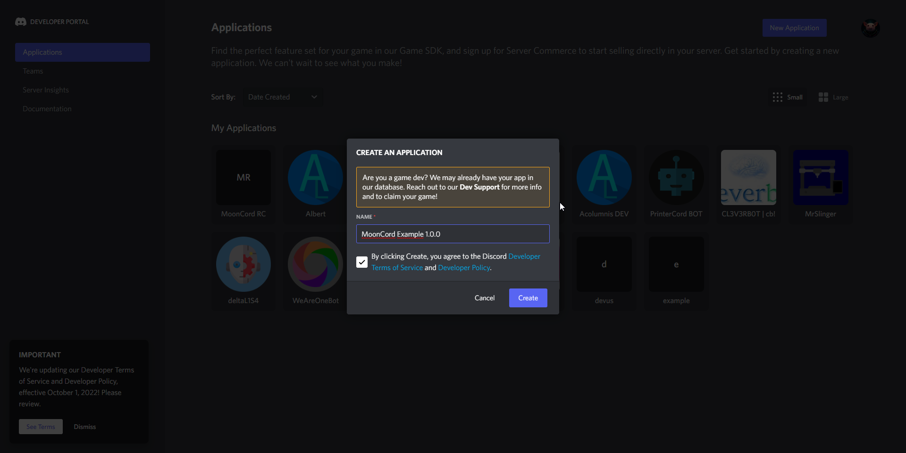
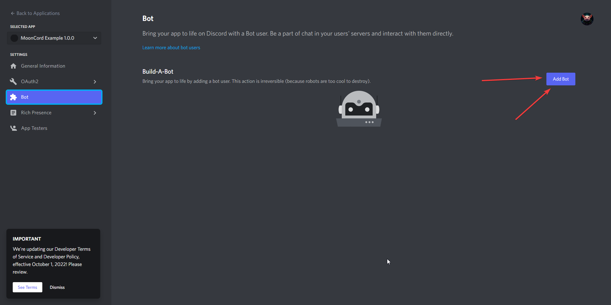
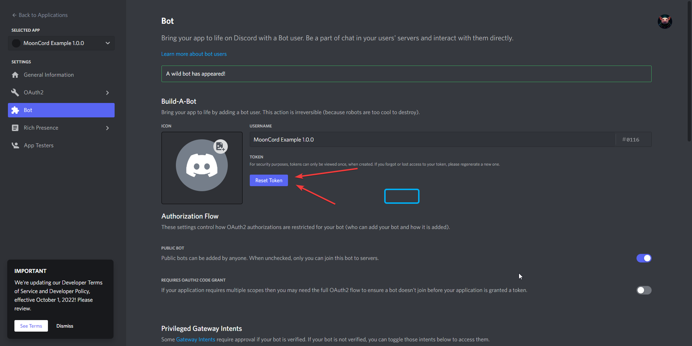
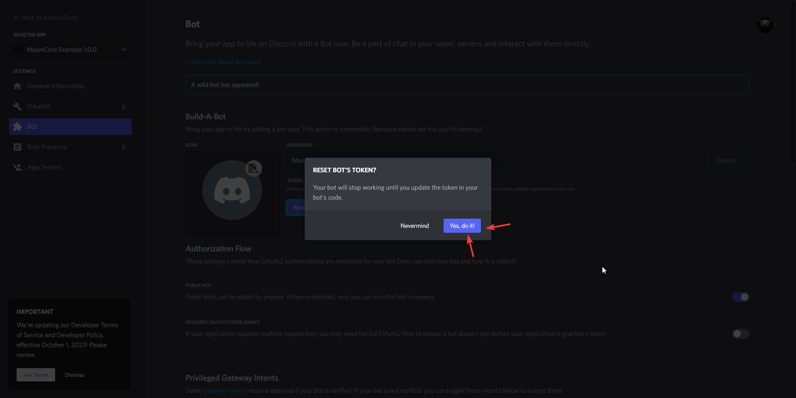
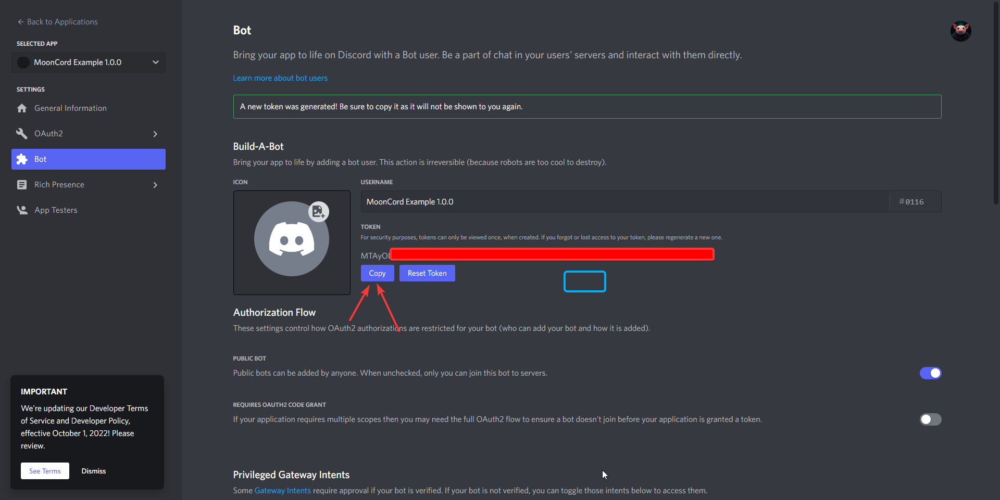
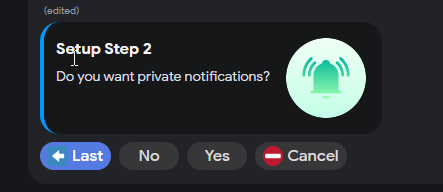

## Preparations
Required Preparations to install MoonCord

### Install Git first
```shell
sudo apt update
sudo apt upgrade
sudo apt install git
```

### Create Discord Application
go to the [Discord Application Page](https://discord.com/developers/applications) and create a new Application.


Name your application:


create a bot:



reset the bot tokeen (you will need the token later in the install script):



copy the bot token for later, you will need it later for the install script.


## Install script

Download MoonCord and start the install script
```shell
cd ~/
git clone https://github.com/eliteSchwein/mooncord.git
cd ~/mooncord
bash scripts/install.sh
```

Now follow the install script, below are screenshots with some explanation what the questions mean.


enter the absolut path to your config directory of your klipper installation, when you have a normal mainsailos you can leave this empty.  
<br>  


enter the absolut path to your logs directory of your klipper installation, when you have a normal mainsailos you can leave this empty.  
<br>


enter your Discord Bot Token from [Create Discord Application](#create-discord-application).  
<br>


  
enter your full Discord Username (not Displayname!), the smaller name (blue square in my screenshot).  
<br>


A present NodeJS installation was found, mooncord 1.0.3 requires nodejs 20, if you have a older or unknown nodejs Version, type Y otherwise type N.  
<br>


the install script is rebuilding NPM to make sure that the packages can successfully install. drink some coffee ☕, eat something 🍔, this step will take some time (on a rpi4 around 7 minutes)...  
<br>

## Install wizard

Before you continue with the install wizard, please make sure the bot is running in setup mode by the [install script](#install-script),  
it should look like the Screenshot above.  
<br>  


Copy Paste the invite Url into your browser (ctrl + c is supported).  
<br>  

         
Select a Server where you have admin permissions or temporary create one.  
<br>  

         
When you invite the Bot, dont untick permissions. this permissions are already the bare minimum.  
<br>  

         
now write your Bot a message via DM (direct message).  
<br>  

         
this is the install wizard, it will guide you through the final installation steps.  
<br>  

         
Do you want private notifications? if yes press yes otherwise no.  
<br>  

         
you can adjust the cam settings, it will update the config in real time and update the message with the new cam settings.  
<br>  

         
check if all steps are correct and if they are just hit finish.  
<br>  

         
mooncord is now finished with the installation.  
<br>  

## Printer configuration
!!! info
    optional configurations for Moonraker and Klipper, they are not required for the base function but are highly recommended.

### Moonraker configuration

#### Authentification
please add `127.0.0.1` (or on a remote installation the ip of your mooncord host) to the `trusted_clients` section
```c
[authorization]
trusted_clients:
  127.0.0.1
```
example moonraker configuration  
<br>

#### Update Manager
please put the following configuration at the end of your moonraker configuration. that way moonraker can update mooncord.
```c
[update_manager client MoonCord]
type: git_repo
path: /home/pi/mooncord
origin: https://github.com/eliteschwein/mooncord.git
install_script: scripts/install.sh
enable_node_updates: True
```
please restart moonraker to apply the changes  
<br>

### Klipper configuration

#### Command Response
this is only required if you want to send a notification via gcode or want to use the timelapse feature)
please put the following configuration at the end of your klipper configuration (printer.cfg).
```c
[respond]
default_type: command
```
please restart your firmware to apply the changes  
<br>

## Additional Attributes
You can add aditional Attributes to the install script for faster deployment or custom service names.

!!! warning 
    only for enhanced users or automation recommended

adding a suffix to the service name `MoonCord_SUFFIX`:
```shell
bash scripts/install.sh --service_suffix=SUFFIX
```
<br>  

predefine the config path:
```shell
bash scripts/install.sh --config_path=/THIS/IS/A/EXAMPLE/PATH
```
<br>  

predefine the log path:
```shell
bash scripts/install.sh --log_path=/THIS/IS/A/EXAMPLE/PATH
```
<br>  

predefine the discord token:
```shell
bash scripts/install.sh --discord_token=DISCORD_TOKEN
```
<br>  

predefine the moonraker token:
```shell
bash scripts/install.sh --discord_token=MOONRAKER_TOKEN
```
<br>  

predefine the moonraker url:
```shell
bash scripts/install.sh --discord_token=MOONRAKER_URL
```
<br>  

predefine the moonraker service:
```shell
bash scripts/install.sh --discord_token=MOONRAKER_SERVICE
```
<br>  

all attributes can be combined of course