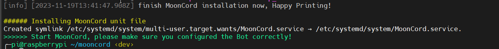

# docker usage

!!! warning
    the docker image is experimental. this is the first time that i make a docker image, i got some help from ChatGPT.

!!! info
    if you dont want to use docker compose, you are on your own.

you can use the official [docker image](https://hub.docker.com/r/tludwigdev/mooncord).  

## Initial Setup

here is a example configuration:

```yaml
services:
  mooncord:
    restart: unless-stopped
    image: tludwigdev/mooncord:latest
    environment:
      - SETUP_NAME=USERNAME
    volumes:
      - /home/hostuser/config/:/config/
```

for the first start pls replace in the example config `USERNAME` with your name (blue square in my screenshot as example).  
  


after that run `docker compose up`, this will generate a docker optimized default configuration.

replace in the config `MOONRAKER_URL` with the ip address or hostname of your printer.  
replace in the config `DISCORD_BOT_TOKEN` with your discord bot token.  
replace in the config `MOONRAKER_TOKEN/API_KEY REMOVE_IF_NOT_PRESENT` with your moonraker api key/token, if not present just replace the whole line with `moonraker_token: ''`.


after that run `docker compose up` again, this will test start MoonCord and also enable the install wizard.

## Install wizard

Before you continue with the install wizard, please make sure the bot is running in setup mode by the [install script](#install-script),  
it should look like the Screenshot above.  
<br>


Copy Paste the invite Url into your browser (ctrl + c is supported).  
<br>

         
Select a Server where you have admin permissions or temporary create one.  
<br>

         
When you invite the Bot, dont untick permissions. this permissions are already the bare minimum.  
<br>

         
now write your Bot a message via DM (direct message).  
<br>

         
this is the install wizard, it will guide you through the final installation steps.  
<br>

         
Do you want private notifications? if yes press yes otherwise no.  
<br>

         
you can adjust the cam settings, it will update the config in real time and update the message with the new cam settings.  
<br>

         
check if all steps are correct and if they are just hit finish.  
<br>

         
mooncord is now finished with the install wizard.  
<br>

## finish Docker Setup
mooncord should automatic stop after finishing the install wizard.  

you should now remove the following section of your docker compose config:

```yaml
environment:
  - SETUP_NAME=USERNAME
```

after that run `docker compose up -d`, the bot should be online and ready.